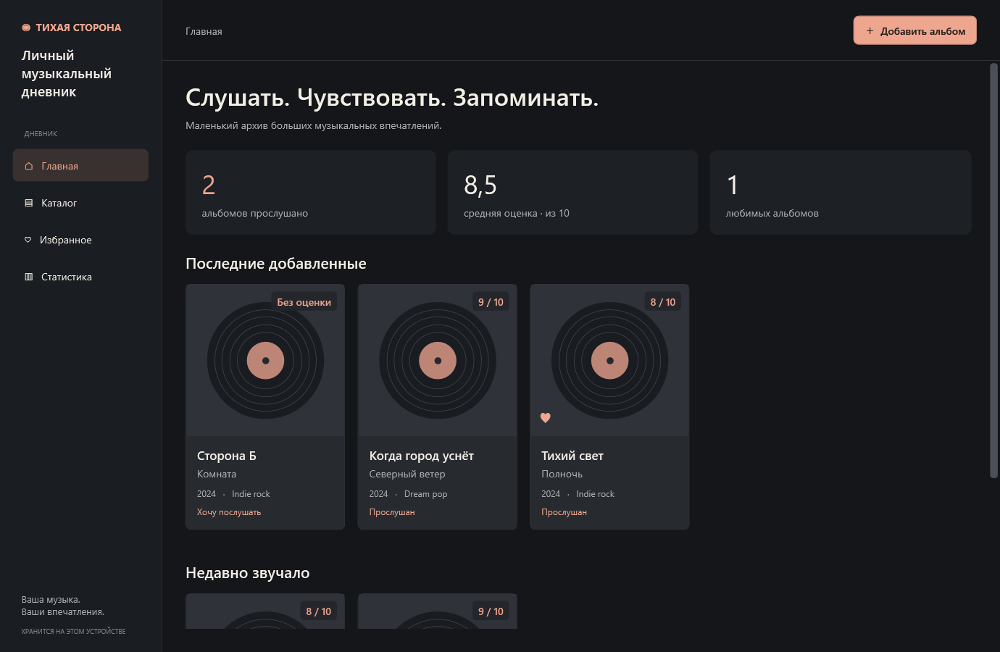

# Личный музыкальный дневник

Desktop-приложение для Windows на C#, WPF и .NET 10. Альбомы, оценки, отзывы, любимые треки и история прослушиваний хранятся локально в SQLite через Entity Framework Core. Интерфейс — на русском, в тёмной indie-эстетике.

## Запуск

Для быстрого запуска дважды щёлкните `Запустить.cmd` в корне проекта.

Готовая сборка: `artifacts/app/MusicDiary.exe`. Запускайте её из этой папки, сохраняя рядом остальные файлы. На этом компьютере нужный .NET Desktop Runtime 10 уже установлен.



Для запуска из исходников откройте `MusicDiary.sln` в IDE с поддержкой .NET 10 и WPF либо выполните из корня проекта:

```powershell
dotnet restore MusicDiary.sln
dotnet run --project MusicDiary/MusicDiary.csproj
```

При первом запуске создаётся пустой дневник и автоматически применяется миграция базы. Демонстрационные записи из тестов не попадают в пользовательскую базу. Интернет нужен для первоначального восстановления NuGet-пакетов; приложение работает без сети.

## Возможности

- Главная: последние добавленные и недавно прослушанные альбомы, количество прослушанных, средняя оценка, число любимых альбомов.
- Каталог: карточки с обложками, два независимых поля поиска, фильтры жанра, статуса и точной оценки, сортировка по дате добавления, году и оценке в обоих направлениях.
- Полный CRUD: создание, просмотр, редактирование, удаление с подтверждением.
- Форма: обязательные поля, проверка года, оценки и даты, обложка, отзыв и список треков.
- Страница альбома: избранное, добавление и удаление треков, любимые треки и заметки. Изменения треков сохраняются кнопкой «Сохранить треки».
- История: отдельные повторные прослушивания с датой, удаление ошибочных записей.
- Избранное: отдельный раздел с теми же возможностями поиска.
- Статистика: распределение оценок, жанры, 10 самых частых исполнителей и уникальные альбомы по месяцам за последние 12 месяцев.
- Проверка несохранённых правок при уходе со страницы и закрытии окна.

## Как пользоваться

1. Нажмите «Добавить альбом», введите название, исполнителя, год и жанр.
2. Выберите статус. Для «Хочу послушать» оценку и дату можно оставить пустыми; для «Прослушан» дата обязательна.
3. При желании выберите обложку, напишите отзыв, добавьте треки и отметьте любимые.
4. Сохраните альбом. Позже откройте карточку из каталога и нажмите «Редактировать альбом» для изменения данных.
5. Чтобы сохранить повторное прослушивание, выберите дату в разделе истории страницы альбома и нажмите «Записать прослушивание».
6. Через «В избранное» добавьте альбом в отдельную подборку. Статистика обновляется после сохранения и перехода на страницу.

## Правила данных

- Оценка: целое число 1–10 либо отсутствие оценки. Пустые оценки не входят в среднее и располагаются после оценённых альбомов при сортировке по рейтингу.
- Название и исполнитель: 1–200 символов; жанр: 1–80 символов; название каждого добавленного трека обязательно.
- Год: от 1000 до текущего года + 2, чтобы можно было сохранить анонсированный релиз.
- Даты прослушивания не могут быть в будущем.
- `CreatedAt` — момент создания записи в UTC; он не изменяется при редактировании.
- `ListeningDate` — самая поздняя дата из истории. Изменение даты в форме исправляет последнюю запись истории, а отдельная кнопка на странице альбома добавляет новое прослушивание. При очистке даты удаляется последняя запись; если есть более ранние, показывается следующая по дате.
- Удаление последнего прослушивания переводит альбом со статуса «Прослушан» в «Хочу послушать».
- Счётчик «прослушано» считает альбомы с текущим статусом `Listened`. Средняя оценка рассчитывается по всем оценённым альбомам. Жанры и исполнители — по всей коллекции без учёта регистра. Диаграмма по месяцам считает уникальные альбомы по истории; повтор одного альбома в том же месяце не увеличивает столбец, но увеличивает общее число прослушиваний.
- Обложки: PNG, JPEG и BMP до 20 МБ; копируются в папку данных. При отсутствии файла показывается графическая пластинка.

## Где находятся данные

```text
%LOCALAPPDATA%/MusicDiary/
  diary.db
  Covers/
```

Обновление или пересборка исходников не удаляет дневник. Для резервной копии закройте приложение и скопируйте всю эту папку. Для восстановления на том же компьютере верните её на место при закрытом приложении. Пути обложек в базе абсолютные; перенос на другой профиль Windows потребует повторного выбора обложек. Неиспользуемые копии обложек сохраняются в `Covers`.

## Архитектура и чтение кода

Подробный план, схема базы, страницы и сценарии находятся в [docs/Architecture.md](docs/Architecture.md).

Рекомендуемый порядок изучения:

1. `Models/Album.cs`, `Track.cs`, `ListeningSession.cs`, `AlbumStatus.cs`.
2. `Data/DiaryDbContext.cs` и начальная миграция `Data/Migrations`.
3. `Services/AlbumService.cs`, `StatisticsService.cs`, `CoverService.cs`, `DialogService.cs`.
4. `Helpers/ObservableObject.cs`, `Commands/RelayCommand.cs`, `AsyncRelayCommand.cs`.
5. `ViewModels/MainViewModel.cs`, затем ViewModel нужной страницы.
6. `Views` и `Themes/Theme.xaml`.

ViewModel не используют `DbContext` напрямую. `AlbumService` создаёт контекст на одну операцию; чтение выполняется через `AsNoTracking`, изменения графа сохраняются одним `SaveChangesAsync`. Команды обрабатывают исключения и блокируют повторное выполнение. Навигация реализована через `CurrentPage` и WPF DataTemplate. Нет контейнера DI и дополнительных слоёв репозиториев: зависимости передаются конструкторами.

## Зависимости

| Пакет | Версия | Назначение |
|---|---|---|
| Microsoft.EntityFrameworkCore.Sqlite | 10.0.9 | EF Core и SQLite |
| Microsoft.EntityFrameworkCore.Design | 10.0.9 | Создание миграций, только разработка |
| SQLitePCLRaw.bundle_e_sqlite3 | 3.0.5 | Актуальная нативная SQLite-зависимость |
| Microsoft.NET.Test.Sdk | 17.14.1 | Запуск тестов |
| xunit | 2.9.3 | Тесты |
| xunit.runner.visualstudio | 3.1.4 | Адаптер тестов |

Графики, MVVM-команды и визуальная тема реализованы средствами C# и WPF без сторонних UI-библиотек. Источники: [Microsoft: WPF и EF Core](https://learn.microsoft.com/en-us/ef/core/get-started/wpf), [NuGet: SQLite bundle](https://www.nuget.org/packages/SQLitePCLRaw.bundle_e_sqlite3/3.0.5).

## Проверка и сборка

```powershell
dotnet test MusicDiary.sln
dotnet build MusicDiary.sln -c Release
dotnet publish MusicDiary/MusicDiary.csproj -c Release -r win-x64 --self-contained false -o artifacts/app
```

Для компьютера без установленного .NET можно собрать автономную версию:

```powershell
dotnet publish MusicDiary/MusicDiary.csproj -c Release -r win-x64 --self-contained true -o artifacts/standalone
```

Тесты работают с временными SQLite-файлами: CRUD, каскадное удаление, история, проверки данных, фильтры, статистика, сохранение и отмена формы. UI-тест на STA-потоке загружает все страницы на двух размерах окна, проверяет привязку поля формы, сохраняет PNG в `MusicDiary.Tests/bin/Debug/net10.0-windows/ui-previews` и проверяет отсутствие ошибок WPF-привязок. Это программная проверка представлений, а не замена ручному тестированию системных диалогов.

Для изменения схемы:

```powershell
dotnet tool restore
dotnet ef migrations add НазваниеИзменения --project MusicDiary --output-dir Data/Migrations
```

Новые миграции применяются при следующем запуске. Не заменяйте миграции вызовом `EnsureCreated`: существующая база должна обновляться последовательно.
