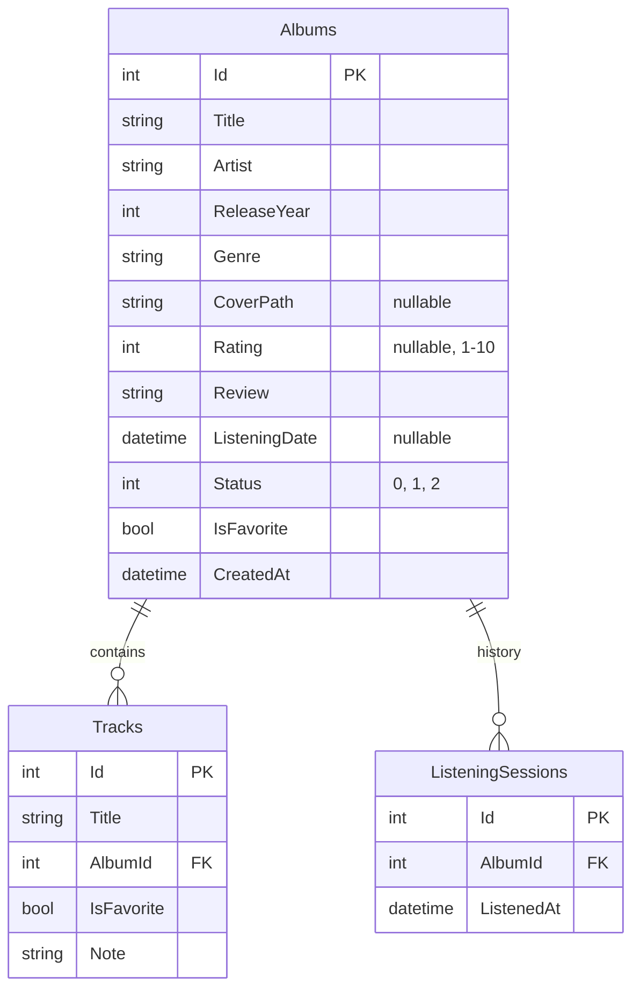

# План проекта

## Структура

```text
MusicDiary.sln
MusicDiary/
  App.xaml                         Регистрация шаблонов страниц
  App.xaml.cs                      Создание сервисов и запуск
  Models/
    Album.cs
    Track.cs
    AlbumStatus.cs
    ListeningSession.cs
  Data/
    DiaryDbContext.cs
    Migrations/
  Services/
    AlbumService.cs                 CRUD, история и треки
    StatisticsService.cs            Расчёт показателей
    CoverService.cs                 Проверка и импорт обложек
    DialogService.cs                Выбор файла и подтверждения
  Commands/
    RelayCommand.cs
    AsyncRelayCommand.cs
  Helpers/
    ObservableObject.cs
    DisplayOptions.cs
    Converters.cs
  ViewModels/
    MainViewModel.cs
    PageViewModel.cs
    DashboardViewModel.cs
    CatalogViewModel.cs
    FavoritesViewModel.cs
    AlbumEditorViewModel.cs
    AlbumDetailsViewModel.cs
    TrackItemViewModel.cs
    StatisticsViewModel.cs
  Views/                           XAML и InitializeComponent
  Themes/Theme.xaml                 Палитра, контролы, карточки, диаграммы
MusicDiary.Tests/
  TestDatabase.cs
  AlbumServiceTests.cs
  ViewModelTests.cs
  UiSmokeTests.cs
```

## Модели и схема базы



Статусы: `WantToListen = 0`, `Listening = 1`, `Listened = 2`. В интерфейсе используются русские подписи. SQLite хранит даты как TEXT, перечисление как INTEGER, флаги как INTEGER 0/1. У обеих дочерних таблиц каскадное удаление по AlbumId. Есть индексы внешних ключей, даты создания альбома и даты прослушивания; CHECK-ограничения оценки, статуса, года, названия и исполнителя. EF дополнительно ведёт служебную таблицу истории миграций.

## Экраны и ViewModel

| Экран | ViewModel | Состояние и команды |
|---|---|---|
| Оболочка | MainViewModel | CurrentPage, Section, IsBusy, Message, навигация и обновление коллекции |
| Главная | DashboardViewModel | RecentAlbums, RecentlyListened, счётчики |
| Каталог | CatalogViewModel | Поиск названия/исполнителя, жанр, статус, оценка, сортировка, сброс |
| Избранное | FavoritesViewModel | Наследует каталог с ограничением IsFavorite |
| Создание / редактирование | AlbumEditorViewModel | Копия полей, список треков, валидация, выбор обложки, сохранение, отмена |
| Альбом | AlbumDetailsViewModel | Данные альбома, редактирование, удаление, избранное, история и команды треков |
| Статистика | StatisticsViewModel | Распределения оценок, жанров, исполнителей и месяцев |

`TrackItemViewModel` обеспечивает уведомления об изменении названия трека, заметки и флага избранного. `PageViewModel` задаёт общий контракт проверки несохранённых изменений. Отдельное представление избранного повторно использует `CatalogView`.

## Поток данных

```text
Кнопка в XAML → ICommand → ViewModel → AlbumService → DiaryDbContext → SQLite
                                         ↓
                                  обновление коллекции
                                         ↓
                             уведомления / новая страница
```

Бизнес-правила находятся в сервисах и ViewModel. Code-behind страниц содержит только InitializeComponent; MainWindow передаёт закрытие окна в проверку ViewModel. App отвечает за сборку зависимостей и инициализацию базы.

## Пользовательские сценарии

1. **Сохранить на потом.** Добавление → обязательные поля → «Хочу послушать» → сохранение → карточка в каталоге.
2. **Записать впечатления.** Открытие карточки → редактирование → статус, дата, оценка и отзыв → сохранение → обновлённые показатели.
3. **Найти запись.** Каталог → два поля поиска и фильтры → сортировка → открытие результата.
4. **Отметить любимое.** Страница альбома → «В избранное» → отдельный раздел. Любимые треки и заметки сохраняются своей кнопкой.
5. **Вернуться к альбому.** Страница альбома → дата в истории → «Записать прослушивание» → новая запись истории.
6. **Исправить или удалить.** Редактирование изменяет существующую запись; удаление с подтверждением удаляет альбом и его дочерние данные.
7. **Продолжить после перезапуска.** Повторный запуск читает тот же SQLite-файл в LocalApplicationData.

## NuGet

EF Core Sqlite и Design 10.0.9; SQLitePCLRaw.bundle_e_sqlite3 3.0.5. Тестовый проект использует Microsoft.NET.Test.Sdk, xunit и xunit.runner.visualstudio. Точные версии и команды запуска приведены в README. Графики — WPF ItemsControl и Border, без отдельной библиотеки.
